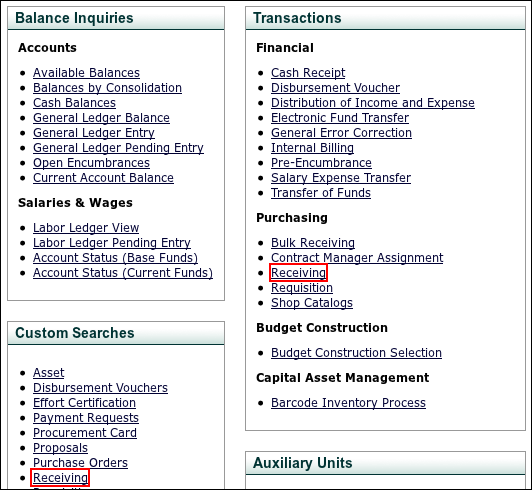
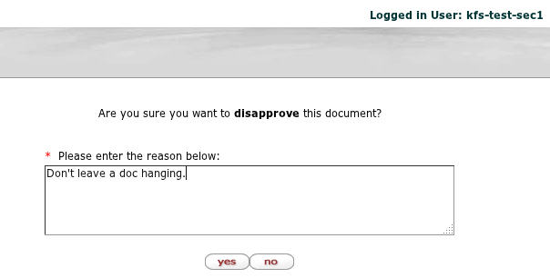
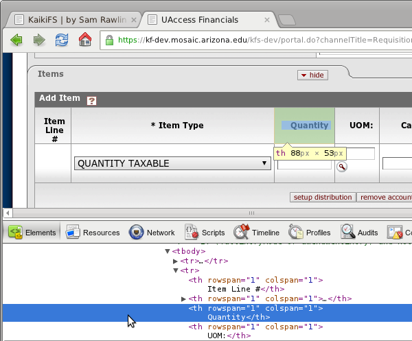
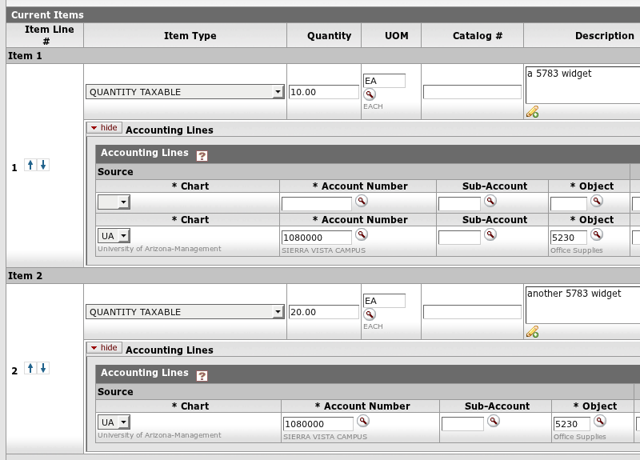

title: KaikiFS
author: Sam Rawlins
scripts: jquery-1.8.2.min.js,bindings.js

%%%%%
%% Add some inline style rules...

%css

a {
  color: inherit;
  text-decoration: none;
}

body {
  background-image: -webkit-linear-gradient(top left, silver, white);
  background-image:    -moz-linear-gradient(top left, silver, white);
  background-image:     -ms-linear-gradient(top left, silver, white);
  background-image:      -o-linear-gradient(top left, silver, white);
  background-image:         linear-gradient(top left, silver, white);
}

.step {
  width: 700px;
  height: 400px;
  padding: 40px 60px;

  font-size: 48px;
  text-align: center;

  opacity: 0.3;
}

.step.active {
  opacity: 1;
}

.slide {
  background: white;
}

code {
  background-color: yellow;
  font-size: 14px;
}

%end

%%%%%%%%%%%%%%%%%%%
%% Here we go...

!SLIDE slide x=-1000 y=-1500

<h2 class="kaikifs">KaikiFS</h2>

Stakeholder-Friendly Acceptance Tests using Cucumber and Selenium

!SLIDE slide x=0 y=-1500

### What is KaikiFS?

KaikiFS is a Ruby project, built on several technologies, primarily **Cucumber**, **RSpec**, and **Selenium 2**.

!SLIDE slide x=1000 y=-1500

This means that Cucumber **scenarios** are **driving a browser** through Selenium, and using RSpec to define the expected **behavior**.

!SLIDE x=0 y=0 scale=4

<h2 class="one-line">Show Me</h2>

<video width="800" height="600" controls="controls">
  <source src="file:///home/sam/code/kaikifs/features/videos/KFSI-1021.feature__0007.webm" type="video/webm">
</video>

!SLIDE x=2700 y=-1500 scale=3

## What is Cucumber?

!SLIDE slide x=4000 y=-1500

Cucumber is a tool for:

* Specifying Behavior
* Writing Acceptance Tests
* Humans

!SLIDE screen x=5000 y=-1500

### small example

<pre><code><strong class='teal'>Feature:</strong> KFSI-5638

  <strong class='teal'>Background:</strong>
    Given <strong>I am up top</strong>

  @jira
  <strong class='teal'>Scenario:</strong> <strong>Searching under Asset Retirement Global doesn't blow up.</strong>

    Given <strong>I am logged in</strong>
    And <strong>I am on the "Central Admin" tab</strong>
    <strong class='yellow'>When</strong> <strong>I click the "Asset Retirement Global" portal link</strong>
    <strong class='yellow'>And</strong> <strong>I click "search"</strong>
    Then <strong>I shouldn't see an incident report</strong>
    And <strong>I shouldn't get an HTTP Status 500</strong>
</code></pre>

!SLIDE x=6000 y=-1500

<h3 class="one-line">Executable Specs</h3>

  

    Given <strong>I am up top</strong>
  

  <pre class="ruby-1"><code>Given /^I am up top$/ do
  kaikifs.switch_to.default_content
end</code></pre>
  

    Given <strong>I am logged in</strong>
  

  <pre class="ruby-2"><code>Given /^I (?:am logged in|log in)$/ do
  kaikifs.backdoor_as kaikifs.username
end</code></pre>
  

    And <strong>I am on the "Central Admin" tab</strong>
  

  <pre class="ruby-3"><code>Given /^I am on the "([^"]*)" tab$/ do |tab|
  kaikifs.switch_to.default_content
  kaikifs.find_element(:link_text, tab).click
end</code></pre>

!SLIDE slide left x=7000 y=-1500

<h2>Feature</h2>

a grouping of tests that all exist in one feature file

"PCard Administration", "Vendor Maintenance"

!SLIDE slide left x=8000 y=-1500

<h2>Scenario</h2>

an example of expected behavior

acceptance criteria

"Canceling a new vendor should not blow up"

!SLIDE slide left x=4500 y=-800

<h2>Scenario Steps</h2>

Given - "setup" steps

When - actual user procedures

Then - expectations, assertions

!SLIDE slide left x=5500 y=-800

<h2>Given</h2>

Setup any context that is not really central or unique to the scenario.

In KaikiFS, "Given I am logged in" and "Given I am up top" are typical.

!SLIDE slide left x=6500 y=-800

<h2>When</h2>

Step-by-step procedure. In KaikiFS, there can be more than a dozen "When" steps.

!SLIDE left hidden x=6500 y=1060 z=1697 rotate-x=-135 scale=0.5

## examples of When steps

!SLIDE hidden x=6500 y=982 z=1904 rotate-x=-127.5 scale=0.5

#### When I open my Action List

!SLIDE hidden x=6500 y=896 z=2078 rotate-x=-120 scale=0.5

#### When I open a doc search

!SLIDE hidden x=6500 y=803 z=2217 rotate-x=-112.5 scale=0.5

#### When I click the "Vendor" portal link

!SLIDE hidden x=6500 y=705 z=2318 rotate-x=-105 scale=0.5

##### When I click the "Receiving" portal link under "Transactions"

!SLIDE hidden x=6500 y=603 z=2379 rotate-x=-97.5 scale=0.5

##### When I click "disapprove" with reason "Don't leave a document hanging"

!SLIDE hidden x=6500 y=500 z=2400 rotate-x=-90 scale=0.5

#### When I start a lookup for "Building"

!SLIDE hidden x=6500 y=397 z=2379 rotate-x=-82.5 scale=0.5

When I return the first result

When I return the first one

When I open the first one

!SLIDE left hidden x=6500 y=295 z=2318 rotate-x=-75 scale=0.5

<strong>When I set the </strong>"Vendor Name"<strong> to </strong>"Micron"

<strong>When I set the </strong>"Requestor Email"<strong> to </strong>"kfsi-5460@arizona.edu"<strong> if blank</strong>

<strong>When I set the </strong>"Description"<strong> to something like </strong>"testing KFSI-1021"

!SLIDE slide left x=7500 y=-800

<h2>Then</h2>

Verification steps. Typically limited to 3 verifications per scenario.

!SLIDE left hidden x=7500 y=1060 z=1697 rotate-x=-135 scale=0.5

## examples of Then steps

!SLIDE hidden x=7500 y=982 z=1904 rotate-x=-127.5 scale=0.5

#### Then I should see "Document was successfully submitted."

!SLIDE hidden x=7500 y=896 z=2078 rotate-x=-120 scale=0.5

#### Then I should see my Action List

!SLIDE hidden x=7500 y=803 z=2217 rotate-x=-112.5 scale=0.5

#### Then I should see "AdHoc Requests have been sent."

!SLIDE hidden x=7500 y=705 z=2318 rotate-x=-105 scale=0.5

#### Then I should see "Actions Taken" in the route log

!SLIDE hidden x=7500 y=603 z=2379 rotate-x=-97.5 scale=0.5

#### Then I shouldn't get an HTTP Status 500

!SLIDE slide left x=5000 y=-100

<h2>Cucumber can test...</h2>

* command line apps
* web applications
* developer tools / libraries

!SLIDE slide x=6000 y=-100

## Once again...

Cucumber **scenarios** are **driving a browser** through Selenium, and using RSpec to define the expected **behavior**.

!SLIDE x=2700 y=800 scale=3

## What is Selenium?

!SLIDE slide x=4000 y=800

## Selenium

* is a _suite of tools_ for automating a browser
* can automate many browsers
* can be driven from many programming languages

!SLIDE x=5000 y=800

"I thought Selenium was that cool browser plugin?"

NO\*

\* actually, yes

!SLIDE slide left x=6000 y=800

Selenium _IDE_ is a neat, bare bones, record/playback Firefox plugin.

Selenium _WebDriver_ is the crazy powerful, awesome fun browser automation tool.

!SLIDE screen x=7000 y=800

### search google for kuali days

<pre><code>sam@mint6510:~$ <strong class="teal">irb -r selenium-webdriver</strong>
>> <strong>driver = Selenium::WebDriver.for :firefox</strong>
=> #&lt;Selenium::WebDriver::Driver:0xad1c23c39ffdb20 browser=:firefox&gt;
>> <strong>driver.navigate.to "http://www.google.com"</strong>
=> ""
>> <strong>driver.find_element(:css, "#gbqfq")</strong>
=> #&lt;Selenium::WebDriver::Element:0x565d748bdaeb54c8...&gt;
>> <strong>driver.find_element(:css, "#gbqfq").send_keys("kuali days 2012")</strong>
=> ""
>> <strong>driver.find_element(:css, "#gbqfq").click</strong>
=> "ok"
>> <strong>driver.find_element(:xpath, "//ol[@id='rso']/li//a").click</strong>
=> "ok"
>> <strong>driver.quit</strong>
</code></pre>

!SLIDE slide left x=8000 y=800

Honestly, Selenium has a pretty cool API, buuut...

!SLIDE slide x=4500 y=1500

## Capybara's is better

&lt;capybara logo not found&gt;

!SLIDE slide x=5500 y=1500

## Capybara...

> "helps you test web applications by simulating how a real user would interact with your app. It is agnostic about the driver running your tests..."

!SLIDE screen x=6500 y=1500

### search google for kuali days

<pre><code>sam@mint6510:~$ <strong class="teal">irb -r capybara -r capybara/dsl</strong>
>> <strong>include Capybara::DSL</strong>
=> Object
>> <strong>Capybara.run_server = false; Capybara.current_driver = :selenium</strong>
=> :selenium
>> <strong>visit "http://www.google.com/"</strong>
=> ""
>> <strong>fill_in("gbqfq", :with => "kuali days 2012")</strong>
=> ""
>> <strong>click_button("gbqfb")</strong>
=> "ok"
>> <strong>find(:xpath, "//ol[@id='rso']/li//a").click</strong>
=> "ok"
>> <strong>quit</strong>
</code></pre>

!SLIDE screen x=7500 y=1500

## Capybara::DSL

<pre><code>fill_in('First Name', :with => 'John')
check('A Checkbox')
select('Option', :from => 'Select Box')

page.has_selector?(:xpath, '//table/tr')
page.has_content?('foo')
page.should have_content('foo')
find(:xpath, "//table/tr").click
</code></pre>

!SLIDE x=2700 y=2800 scale=3

## What is so great about KaikiFS?

("I like my Selenium IDE...")

!SLIDE x=8000 y=4200 rotate=0

### Record Video

!SLIDE x=7848 y=3435 rotate=-23

### Automatically screenshot point of failure

!SLIDE x=7414 y=2786 rotate=-45

### Log every click and attempt to find an element

!SLIDE x=6765 y=2352 rotate=-68

### Fill in fields by their "label"

!SLIDE x=6000 y=2200 rotate=-90

!SLIDE x=5235 y=2352 rotate=-113

!SLIDE x=4586 y=2786 rotate=-135

!SLIDE x=4152 y=3435 rotate=-158

### Fill in fields by their position in a list

"first" Vendor Address

"second" Accounting Line

!SLIDE x=4000 y=4200 rotate=-180

!SLIDE x=4152 y=4965 rotate=-202

### "Remember" information during the scenario

!SLIDE screen x=4586 y=5614 rotate=-225

<pre><code>And I click "<strong>submit</strong>"
Then I should see "<strong>Document was successfully submitted.</strong>"
When I record this document number
<strong class="teal">  1232486</strong>
When I record this "<strong>Requisition #</strong>"
<strong class="teal">  Requisition # = 60809</strong>
And I backdoor as "<strong>kfs-test-sec-2</strong>"
And I open my Action List, refreshing until that document appears
...
And I click "<strong>approve</strong>"
Then I should see my Action List
When I backdoor as "<strong>kfs-test-sec22</strong>"
And I open my Action List, refreshing until that document appears
And I open that document
And I click "<strong>approve</strong>"
Then I should see my Action List
When I backdoor as "<strong>kfs-test-sec40</strong>"
And I am on the "<strong>Main Menu</strong>" tab
And I click the "<strong>Contract Manager Assignment</strong>" portal link
And I fill out the following for that "<strong>Requisition #</strong>":
  | Contract Manager | 10 |
And I click "<strong>submit</strong>"
</code></pre>

!SLIDE x=5235 y=6048 rotate=-247

### Handle asynchronous activity

!SLIDE x=6000 y=6200 rotate=-270

### Highlight page elements during scenario

!SLIDE x=6765 y=6048 rotate=-293

### Speed up, slow down, pause scenarios

!SLIDE x=7414 y=5614 rotate=-315

### Integrate into your CI

!SLIDE x=7848 y=4965 rotate=-337

a

!SLIDE x=3000 y=1500 scale=10

%% The End
%%%%%%%%%%%%%%%
